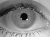
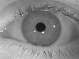
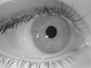
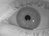
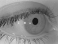
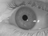
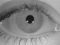
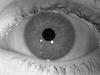

# WVU: Iris Biometric In Difficult Conditions Dataset (IBIDC)

Available to researchers under the CITeR Database Release Agreement.

Off axis/angle iris dataset contains images collected with two cameras, a Sony Cyber Shot DSC F717 and a black and white, monochrome camera. The angles are as accurate as the subject can hold their eye in position. The Sony camera was used in infrared mode, called night vision. However, while the camera was still in night vision mode, it still used all three RGB sensor data hence the green hue to the images.

| Device | Sony Cyber ShotDSC F717 | Monochrome Camera |
| :--- | :--- | :--- |
| # of Sessions | 1 | 1 |
| # of Subjects | 19 | 73 |
| Eye | Left and Right | Left and Right |
| Gaze Direction ( Angle in Degrees ) | 0, 15, 30 | 0, 15, 30, 0 |
| # of Files | 268  | 597 |
| Iamge Type | JPG, TIF | BMP |
| Spectrum | Infrared Mode | Visible Mode |
| Distance Eye-Camera | ~4 Inches | ~4 Inches |
| Illumination | Ceiling, Abient Office Lighting | Ceiling, Abient Office Lighting |
| Location | Indoor | Indoor |

Example of Iris Images:

Information source from the deprecated link at: https://citer.clarkson.edu/research-resources/biometric-dataset-collections-2/off-axisangle-iris-dataset-release-1/.
